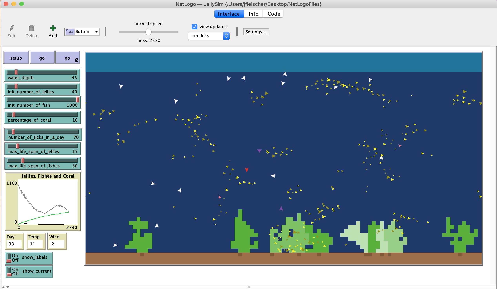

Net Logo Projects
=================

#Setup

1. Install the NetLogo application found here:
https://ccl.northwestern.edu/netlogo/ 

2. Open one of the .nlogo files with the NetLogo application

3. Press the 'setup' button

4. Run by pressing a 'go' or 'train' button

# NetLogo files (.nlogo)

## JellySim.nlogo

Simulates the lifecycle of jellyfish, coral and fish

## Trainer.nlogo

Uses weighted edges to eventually learn a desired outcome

## Grid.nlogo

Smooths out the colors in a grid

# Notes

- Files were created with NetLogo version 5.1 but can run on NetLogo version 6.1.1
- These files were created for university assignments / projects with the purpose of understanding machine learning concepts

# JellySim Screen Shot

